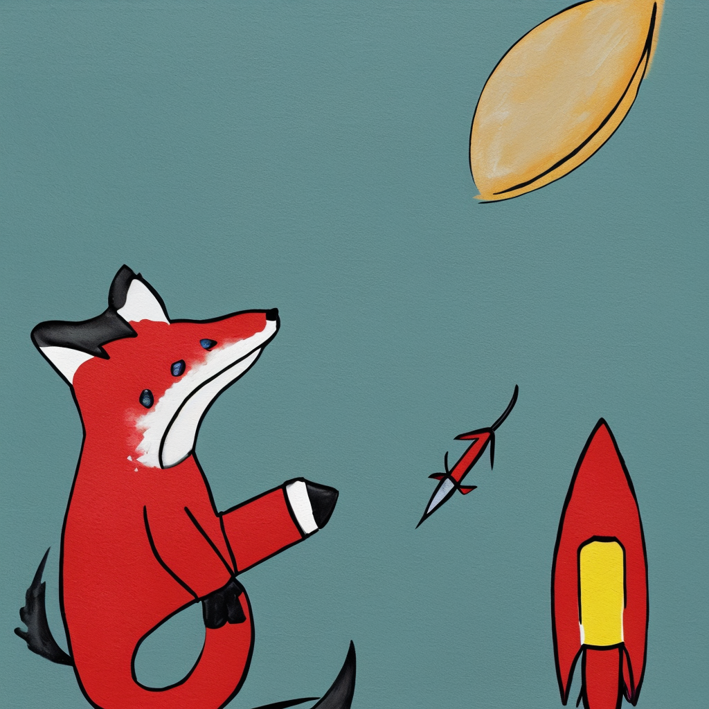

# This is supposed to be a fox riding a rocket to the moon



## Installation

`pip install -r requirements.txt`

## Start collection

 
```py
python start_fox.py
```

## Isolated run

```py
python measure_ram.py <prompt> <size> <steps> <repetitions>
```

Example:

```py
python measure_ram.py --prompt "A fox riding a rocket to the moon" --size 768 --steps 100 --repetition 3
```

## Generating plots

Please refer to [plots.ipynb](./plots.ipynb)

## Notes

The `measure_ram.py` script has a `pipe` variable which is the actual model. When collecting data for a quantized model, that variable will have to be swapped out for the quantized model.